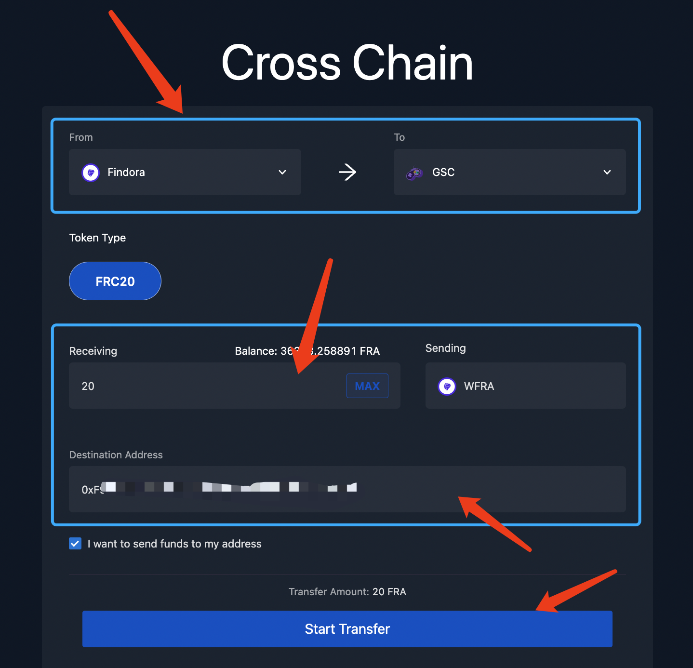

# User Guide

### Bridging FRA → wFRA

GSCs use wrapped FRA tokens (wFRA) by default for gas, but they can support native tokens, depending on developer needs. If you are using a GSC that uses wFRA you can bridge your FRA to the GSC using [Rialto bridge](https://rialtobridge.io). To use the bridge:

1. Go to the [Rialto Bridge](https://rialtobridge.io/transfer)&#x20;
2. Set a transfer from the Findora Network to the Findora GSC Network&#x20;
3. Select the amount of FRA you want to bridge and which wallet you want to receive the wFRA.

You’ll receive the same number of wFRA as the FRA you transfer over.&#x20;

<figure><figcaption></figcaption></figure>

\
You can find transactions on GSCs on a special [GSC chain explorer](https://gsc-mainnet-blockscout.prod.findora.org/).

### Adding GSC to MetaMask

To add GSC, open your MetaMask, click on the network drop-down in the top left corner and then “Add network at the bottom of the dialog box. Next, click on “Add a network manually” at the bottom of the page.

Once there, copy/paste the information below exactly. Don’t leave spaces or any slashes (/) at the end:

**Mainnet RPC:**

<table><thead><tr><th width="270">Type</th><th>Network Setting</th></tr></thead><tbody><tr><td>RPC</td><td><a href="https://gsc-mainnet.prod.findora.org:8545">https://gsc-mainnet.prod.findora.org:8545</a></td></tr><tr><td>Chain ID</td><td>1204</td></tr><tr><td>Block Explorer</td><td><a href="https://gsc-mainnet-blockscout.prod.findora.org/">https://gsc-mainnet-blockscout.prod.findora.org/</a></td></tr></tbody></table>

### Other Network Info

To add the GSC on testnet, use the following information:&#x20;

\
**Testnet RPC**

| Type           | Network Setting                                                                        |
| -------------- | -------------------------------------------------------------------------------------- |
| RPC            | [https://gsc-testnet.prod.findora.org:8545](https://gsc-testnet.prod.findora.org:8545) |
| Chain ID       | 1205                                                                                   |
| Block Explorer | [https://gsc-testnet.evm.findorascan.io/](https://gsc-testnet.evm.findorascan.io/)     |

To bridge tokens on testnet, make sure to use the Rialto Bridge on the Anvil testnet: [https://anvil.rialtobridge.io/](https://anvil.rialtobridge.io/)&#x20;

### FRA Mainnet Faucet (for initial gas)

If you need just FRA dust on mainnet for initial gas fees, use the mainnet faucet created by Findora validator, YogurtRocks: [https://www.yogurt.rocks/faucet/](https://www.yogurt.rocks/faucet/)&#x20;

\
For testnet tokens, use: [https://faucet.findora.org/](https://faucet.findora.org/) on the Anvil testnet. Once you claim testnet FRA, you can bridge it to the GSC testnet using [https://anvil.rialtobridge.io/](https://anvil.rialtobridge.io/).
