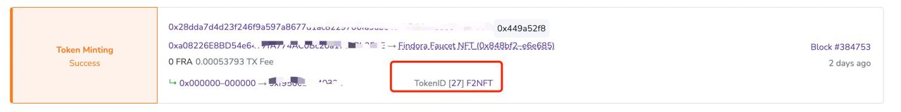

# Prism++

Prism++ supports users to transfer FRC20, FRC721, FRC1155 between Findora EVM network and Findora Native. You can download the testnet wallet to experience it.

1. Visit [findora.org/testnet](https://www.findora.org/testnet), download and install the testnet wallet according to your computer system

<figure><figcaption></figcaption></figure>

2. Add Anvil testnet to the testnet wallet

<figure><figcaption></figcaption></figure>

| Paremeters              | Value                                 |
| ----------------------- | ------------------------------------- |
| Network Node Nickname   | Anvil                                 |
| Network Node URL        | https://prod-testnet.prod.findora.org |
| Blockchain Explorer Url | https://prod-testnet.findorascan.io   |

3. Add Anvil testnet to metamask

| Parameters         | Value                                      |
| ------------------ | ------------------------------------------ |
| Findora Qa01       | https://prod-testnet.prod.findora.org:8545 |
| Chian ID           | 2153                                       |
| Block explorer URL | https://testnet-anvil.evm.findorascan.io   |

 (5).png>)

4. Create a new wallet in the testnet wallet, please do not import mnemonic or private keys that own mainnet assets into the testnet wallet

<figure><figcaption></figcaption></figure>

5. Visit [Findora Faucet](https://faucet.findora.org/) to receive Anvil FRA-EVM test coins and FRC20 test coins

 (1) (1).png>)

6. Click Prism, select EVM-Compatible Wallet to Native Wallet

<figure><figcaption></figcaption></figure>

7. import the Metamask private key, and you can check the balance of your EVM-FRA

<figure><figcaption></figcaption></figure>

8. Click Asset Type to select the asset you want to send, prism++ is an upgrade to Prism. It not only supports FRC20, but also supports FRC721 and FRC1155 tokens in the Findora EVM network. You can enter the contract address to search and select the token you want to prism. for the FRC721 and FRC1155, you need a additional `tokenID` as input. The `tokenID` can be found  on your transaction history on our explorer, or any wallets supported NFT.

<figure><figcaption></figcaption></figure>

9. After the transaction is completed, the token from EVM prism to Native will become a new asset in Native, and you can check it from the wallet balance.

<figure><figcaption></figcaption></figure>

<figure><figcaption></figcaption></figure>

10. You can also view the asset code of this asset in the Native network in asset management.

<figure><figcaption></figcaption></figure>

As an extra reminder, only after adding the native asset code in asset management can it be displayed on the sending and balance pages. If your native asset is not displayed, you need to click the Add button to add it manually.

<figure><figcaption></figcaption></figure>

11. When an FRC20, FRC721, or FRC115 token on the EVM network is transferred to the Native network through the Prism++ function, it becomes a native asset. Then it has all the attributes of the native network, and these assets can also be set for privacy when they are traded.

<figure><figcaption></figcaption></figure>

12. You can also transfer them from the Native network back to the EVM network again

<figure><figcaption></figcaption></figure>
