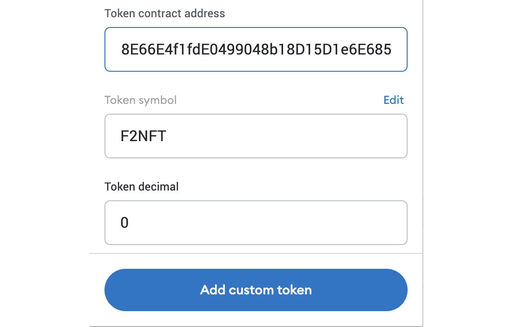

# 🧑🎨 🧑🎨 Pilgrim: FRC 721 Token Transfers

### Fund your EVM Wallet with 721 Tokens

1. Visit[ Findora Faucet](https://faucet.findora.org/) to fund your EVM Wallet with FRC 721 tokens.&#x20;

<figure><figcaption></figcaption></figure>

2. To see this asset in your MetaMask wallet, you'll need to import it. Click "Import Tokens" in your MetaMask. Then input the token information:&#x20;

<figure><figcaption>
Token contract address:  0x848bF2788E66E4f1fdE0499048b18D15D1e6E685
</figcaption></figure>

Once in input the Token contract address, the Token symbol, F2NFT should auto-populate, but you will still need to put 0 as the token decimal.&#x20;

Token contract address: 0x848bF2788E66E4f1fdE0499048b18D15D1e6E685

### Transfer FRC721 Tokens from MetaMask to the Findora Wallet

1. Now that there FRC721 tokens in your MetaMask wallet, go to the Findora wallet to use Prism++ to transfer some to your first UTXO wallet. Set the transfer to go from the EVM wallet to the Native wallet, and select the EVM wallet you used to transfer FRC20 tokens.

<figure><figcaption></figcaption></figure>

2. In asset type, select FRC721 tokens. Put in the Token contract address for FRC721 tokens: 0x848bF2788E66E4f1fdE0499048b18D15D1e6E685&#x20;
3. To find the Token ID of your FRC721 tokens, you'll need to use the Findora Anvil chain explorer: [https://testnet-anvil.evm.findorascan.io/](https://testnet-anvil.evm.findorascan.io/)&#x20;
4. Once there, search your EVM wallet address and click the "Token Transfers" tab. You should see the transaction funding your EVM wallet with FRC721 tokens and see the token ID in the lower left corner of the transaction.

<figure><figcaption></figcaption></figure>

5. Once you've put the TokenID in to the Findora wallet, you'll click on the "Findora Faucet" token that appears. After that, you'll be able to finish the transaction from your MetaMaks to your first UTXO "fra..." wallet.

<figure><figcaption></figcaption></figure>

### Confidentially transfer your 721 Tokens from UTXO wallet 1 -> UTXO wallet 2

1. To confidentially send an FRC721 token from your first UTXO Wallet to the second, go to the Send tab in the sidebar.
2. The Findora Desktop Wallet supports confidential transfers to help you customize the level of privacy you prefer for your transfers. But for this task, please mask both the Asset Type and Asset Amount. Choose "Hide Amount" and "Hide Asset Type."

<figure><figcaption></figcaption></figure>

3. After you send it to the second wallet, you'll need to add the FRC721 Asset code to the second wallet. Without adding it, you won't be able to see the FRC721 token in that second UTXO wallet.
4. You can find the asset code by going into your first UTXO wallet and clicking "Manage Assets." Find the 721 token and copy the Asset code

<figure><figcaption></figcaption></figure>

5. Sill in the Manage Assets tab, click the Add button to add the NFT to Wallet2.&#x20;

<figure><figcaption></figcaption></figure>

### Prism++ your 721 Tokens (Native->EVM)

Finally, use Prism++ to transfer the FRC721 token back to your EVM wallet.

<figure><figcaption></figcaption></figure>

\
