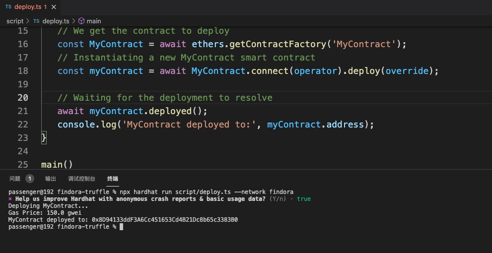

# 💰 Testnet Wallet Setup/Funding


#### NOTE: If you have a Findora wallet already, be sure to export your private keys before downloading the testnet wallet! This is the best practice for any wallet because the private keys will allow you to recover your wallet if anything happens.


### Wallet Setup&#x20;

1\. Visit[ findora.org/testnet](https://www.findora.org/testnet), download and install the testnet wallet.&#x20;

<figure><figcaption></figcaption></figure>

2\. Add Anvil testnet to the testnet wallet and configure to Anvil. You can also find the network info on [https://faucet.findora.org/](https://faucet.findora.org/).&#x20;

<figure><figcaption></figcaption></figure>

<figure><figcaption></figcaption></figure>

| Network Node Nickname   | Anvil                                 |
| ----------------------- | ------------------------------------- |
| Network Node URL        | https://prod-testnet.prod.findora.org |
| Blockchain Explorer Url | https://prod-testnet.findorascan.io   |

3\. Add Anvil testnet to metamask and configure MetaMask to Anvil testnet.&#x20;

| Network Name       | Anvil                                    |
| ------------------ | ---------------------------------------- |
| Chian ID           | 2153                                     |
| Block explorer URL | https://testnet-anvil.evm.findorascan.io |

<figure><figcaption></figcaption></figure>

4\. Create two new UTXO wallet in the testnet wallet, please do not import mnemonic or private keys that owns mainnet assets into the testnet wallets. You will be asked to register those two UTXO wallets during campaign registration, please always use those two wallets during the campaign.&#x20;

<figure><figcaption></figcaption></figure>

### Wallet Funding

You will need FRA tokens in both your EVM Wallet and your UTXO Wallet during the campaign in order to complete transactions during the campaign.

5\. Visit[ Findora Faucet](https://faucet.findora.org/) to receive Anvil FRA-EVM test coins in your MetaMask.&#x20;

<figure><figcaption></figcaption></figure>

6\. Click Prism++, select EVM-Compatible Wallet to Native Wallet and choose FRA tokens.&#x20;

<figure><figcaption></figcaption></figure>

7\. Import the private key to your EVM wallet.

<figure><figcaption></figcaption></figure>

8\. Fund your two native wallets with FRA tokens by Prism++ some FRA tokens to your Native Wallet. You will need FRA tokens to pay for gas fees for any further transactions on the Findora Native Chain.&#x20;

<figure><figcaption></figcaption></figure>

\
\
\
\
\
\
\
\
\
\

##
