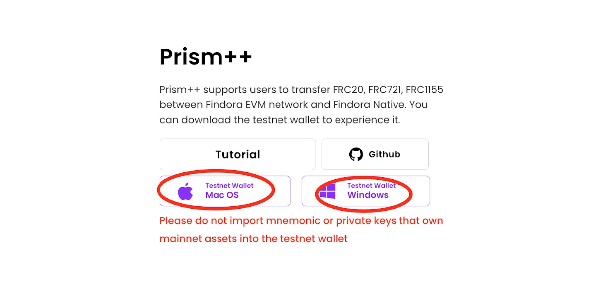

# 💰 Testnet Wallet Setup/Funding


If you already have a Findora wallet, **export your private keys** before downloading the testnet wallet. This is best practice and allows you to recover your wallet if anything happens.



If your Findora wallet is using v0.3.4, and already have the Anvil testnet network added, you will encounter issues during the campaign. **Please make sure to delete the Anvil network from your v0.3.4 wallet** before installing the testnet wallet.


### Testnet Wallet Install & Setup

**1.** Visit[ findora.org/testnet](https://www.findora.org/testnet). Download and install the testnet wallet. If using MacOS, you may need to adjust your security settings to install the wallet.

<figure><figcaption>
Download the Testnet Wallet
</figcaption></figure>

**2.** Click "Settings", then click "Manage" under the Network category, then add the Anvil network.

<figure><figcaption>
Adding Anvil testnet to the wallet.
</figcaption></figure>

**Anvil network details below:**

| Network Node Nickname   | Anvil                                 |
| ----------------------- | ------------------------------------- |
| Network Node URL        | https://prod-testnet.prod.findora.org |
| Blockchain Explorer Url | https://prod-testnet.findorascan.io   |

**3.** Create two new UTXO wallets in the Findora Testnet Wallet application. You will need to use these two addresses throughout the campaign and for registration.


**Do not import mnemonic or private keys that own mainnet assets.**


<figure><figcaption>
Adding Two UTXO Wallets to the Findora Testnet Wallet App
</figcaption></figure>

**4.** Open your Metamask wallet and add the Anvil testnet network.

**Anvil network details below:**

| Network Name       | Anvil                                                                                    |
| ------------------ | ---------------------------------------------------------------------------------------- |
| RPC URL            | [https://prod-testnet.prod.findora.org:8545](https://prod-testnet.prod.findora.org:8545) |
| Chain ID           | 2153                                                                                     |
| Block explorer URL | https://testnet-anvil.evm.findorascan.io                                                 |

<figure><figcaption>
Adding Findora's Anvil Network to Metamask
</figcaption></figure>

### Wallet Funding


You will need FRA tokens in Metamask and the Findora Testnet Wallet for gas fees.


**1.** Visit[ Findora Faucet](https://faucet.findora.org/) to receive testnet FRA-EVM tokens. **Enter your 0x... address** to claim them in your Metamask wallet.

<figure><figcaption>
Claiming Testnet FRA Tokens
</figcaption></figure>

**2.** Open your Metamask wallet, select the Anvil network, and ensure your testnet FRA is received.

**3.** Open the Findora Testnet Wallet, click on Prism++, and then click "Select Wallet".

**4.** Import the private key to your EVM wallet and click Confirm.

<figure><figcaption>
Adding an EVM Wallet to Findora Testnet Wallet
</figcaption></figure>


By importing your private key from Metamask, Prism++ will have the ability to bridge testnet assets from EVM to UTXO in later steps.


**5.** Set the direction to EVM-Compatible Wallet **>>** Native Wallet.

Then choose FRA as the Asset Type.&#x20;

<figure><figcaption>
Setting Direction and Choosing the Asset Type
</figcaption></figure>


Make sure to find **both** of your two UTXO wallets with FRA tokens.

