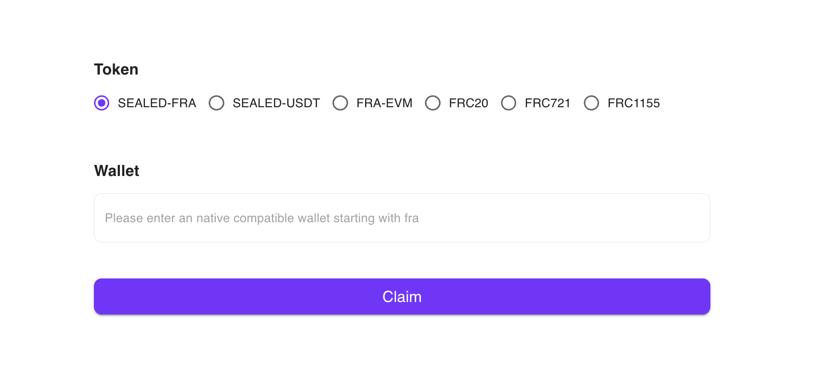
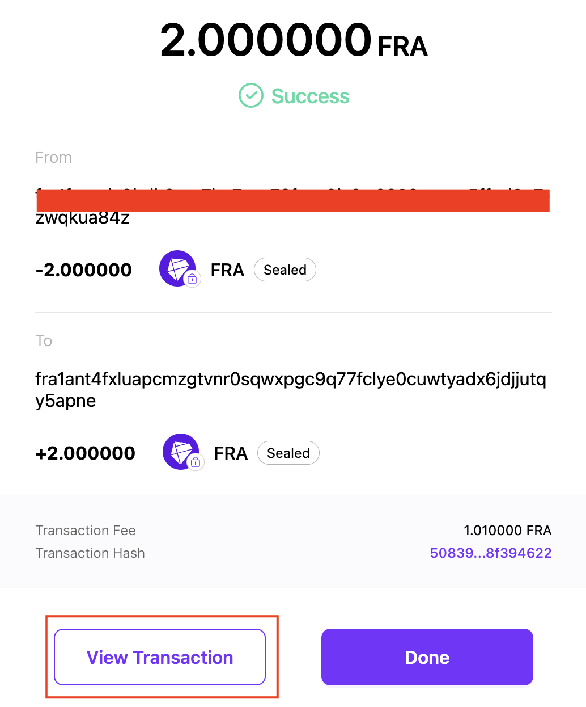
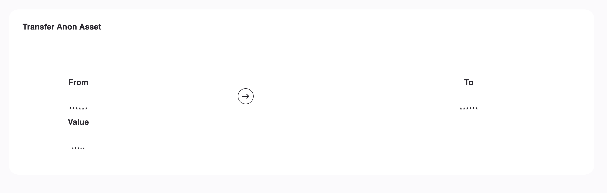

# Triple Masking Demo

Try Triple Masking for yourself and see what encrypted blockchain data looks like! Using the Triple Masking SDK, you will be able to implement it on your own dApp or project.

### Download the Triple Masking Demo

To get started, download the Triple Masking Demo from Findora’s website:

1. Visit our website at[ findora.org/testnet](http://findora.org/testnet).
2. Download the Triple Masking Demo.

You might need to bypass the security measures on MacOS and Windows. Allowing the one-time download of the app won’t permanently change your security settings.

Installing on Windows

When you install it on Windows, Windows will tell you a security scan is required. Click "Dismiss" to download the executable. Once you do so, you'll get another warning message saying Windows protected your PC. Click "More Info" and then "Run Anyway." After that, you can run the Triple Masking Demo to finish the process.

Installing on MacOS

When you first try to download it, MacOS will show a warning that this app cannot be downloaded.

To bypass it, go to System Settings >  Privacy and Security and allow the download

### Create a Wallet

Once you have downloaded the app, create a wallet inside the demo to send and receive triple-masked transactions. Click on the Test Wallet tab. You can import an existing wallet, but the simplest option is to click "Create" to make a new one.

Follow the prompts to create a new crypto wallet.&#x20;


💡 Keep in mind this is a testnet demo, and none of the funds in it will be real. However, it is still best practice to keep your mnemonic phrase secret and to securely store your private key.


### Acquiring Testnet Tokens

With your wallet set up, you'll now need some testnet tokens from our testnet [web-faucet](https://faucet.findora.org/). Head to [https://faucet.findora.org/](https://faucet.findora.org/), connect your MetaMask wallet, and switch to the Anvil testnet network at the top of the page.

At the bottom of the page, Select “Sealed-FRA” and input your newly created Triple Masking wallet address. It should begin “fra…”

<figure><figcaption></figcaption></figure>


💡 Once you hit “Claim,” it may take up to 15 minutes for your tokens to arrive.


### Sending a Triple Masked Transaction

Now that you have your tokens, send a Triple Masked transaction.

1. Go to the “Send” tab.
2. Select your wallet as the “From” account.
3. Input a “To” account. You can just use the address at the top of the Send tab or create a second wallet.&#x20;

After you've sent the transaction, you'll be directed to a Success page. Click the "View Transaction" button to see your transaction in the block explorer. Clicking “View Transaction” will take you directly to the transaction on the testnet block explorer.&#x20;

<figure><figcaption>
Click on the "View Transaction" button at the bottom
</figcaption></figure>

As you’ll be able to see, your transaction information is protected; the wallet address, token amount, and token type are all encrypted and not publicly visible.

<figure><figcaption></figcaption></figure>

### Completing the Feedback Survey

Lastly, we'd love your thoughts and feedback! To let us know what you think, fill out the [Demo Survey on Typeform](https://form.typeform.com/to/OlI3WGAG), where we’ll ask for your feedback on Triple Masking and how it can be applied in Web3.

Your [responses](https://form.typeform.com/to/OlI3WGAG) will help us improve!
